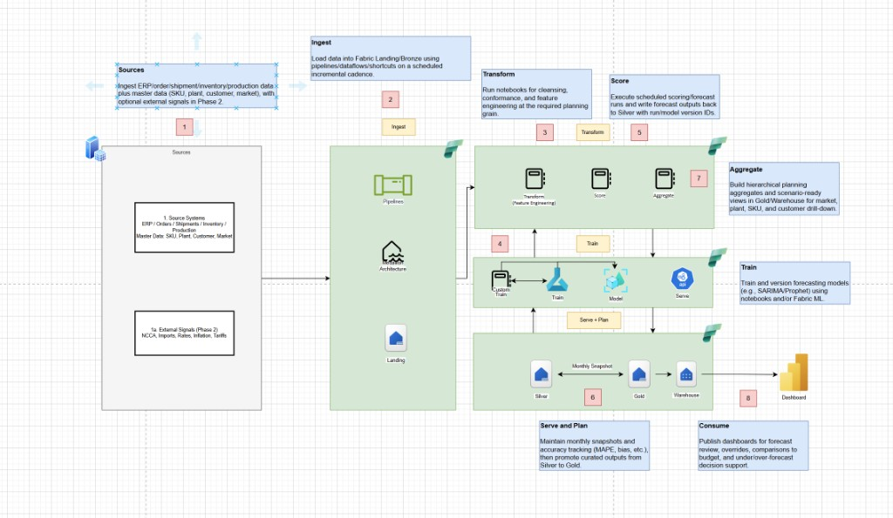

# Fabric Analytics Pipeline

Config-driven demand forecasting pipeline on Microsoft Fabric following medallion architecture (Landing -> Bronze -> Silver -> Gold), with XGBoost, SARIMA, and Exponential Smoothing models, MLflow experiment tracking, and idempotent PowerShell deployment.

## Architecture



## Step-by-Step Flow

### 1. Sources
- ERP/operational tables (orders, shipments, inventory, production, master data) exist in a source lakehouse.
- Table names are listed in `deploy/deploy.config.toml` under `[source].tables`.

### 2. Ingest (Landing)
- `01_ingest_main` reads each source table and writes a raw copy to the Landing lakehouse as Delta.
- Full overwrite on each run (snapshot pattern).

### 3. Transform (Bronze)
- `02_transform_main` reads from Landing, deduplicates rows, drops all-null records, stamps `_ingested_at`, and writes to Bronze lakehouse.

### 4. Feature Engineering (Silver)
- `03_feature_engineering_main` reads the primary table from Bronze.
- Aggregates to the configured grain (`grain_columns` + `date_column` at `frequency`).
- Adds lag features (1, 2, 3, 6, 12 periods).
- Adds rolling mean/std (3, 6, 12 windows).
- Adds calendar features (month, quarter, year, cyclical sin/cos).
- Writes `feature_table` to Silver lakehouse.

### 5. Train (Silver)
Three model notebooks read `feature_table` from Silver:

**XGBoost** (`04_train_xgboost_main`)
- Splits by time (configurable `test_split_ratio`).
- Trains `XGBRegressor` with config hyperparameters.
- Logs to MLflow: params, train/test metrics (RMSE, MAE, MAPE, R2), feature importances.
- Registers model as `{registered_model_prefix}_xgboost`.
- Writes `xgboost_predictions` to Silver.

**SARIMA** (`04_train_sarima_main`)
- Fits `SARIMAX` per grain combination with config `order` and `seasonal_order`.
- Grains with fewer than `2 * seasonal_period` observations are skipped.
- Logs aggregate metrics to MLflow.
- Writes `sarima_predictions` to Silver.

**Exponential Smoothing** (`04_train_exp_smoothing_main`)
- Fits Holt-Winters `ExponentialSmoothing` per grain with config `trend`, `seasonal`, `seasonal_periods`.
- Same skip/logging pattern as SARIMA.
- Writes `exp_smoothing_predictions` to Silver.

### 6. Score (Gold)
- `05_score_main` loads registered models and scores:
  - XGBoost: Fabric `PREDICT` (`MLFlowTransformer`) for batch scoring, falls back to `mlflow.pyfunc`.
  - SARIMA/Exp Smoothing: re-fits on full history per grain, forecasts `forecast_horizon` steps ahead.
- Writes combined `forecast_results` to Gold lakehouse.
- Writes `model_metrics` comparison table to Gold.

### 7. Aggregate (Gold)
- `06_aggregate_main` reads forecast results from Gold.
- Builds hierarchical roll-ups per grain level (e.g., by plant, by plant+SKU).
- Writes aggregate tables (`agg_{model}_by_{grain}`, `agg_grand_total`) to Gold.

### 8. Consume
- Gold tables are ready for Power BI dashboards, warehouse views, or downstream APIs.

## MLflow Experiment Tracking

All training notebooks use Fabric's native MLflow integration:
- `mlflow.set_experiment(experiment_name)` creates/reuses the experiment.
- Each training run logs: hyperparameters, train/test metrics, model artifacts.
- XGBoost also logs feature importance values.
- SARIMA/Exp Smoothing log per-grain aggregate metrics and config JSON artifacts.
- Models are registered in Fabric's built-in model registry via `mlflow.register_model()`.

## Function-Calling Contracts (Model I/O)

### XGBoost
- **Input**: all numeric columns from `feature_table` excluding date, target, and grain columns.
- **Output**: `predicted` column (float).
- **Registration**: `{registered_model_prefix}_xgboost`

### SARIMA
- **Input**: time series of `target_column` per grain combination.
- **Output**: `predicted` (float) for each `forecast_step`.
- **Config**: `sarima_order = [p, d, q]`, `sarima_seasonal_order = [P, D, Q, s]`

### Exponential Smoothing
- **Input**: same as SARIMA.
- **Output**: same as SARIMA.
- **Config**: `exp_smoothing_trend`, `exp_smoothing_seasonal`, `exp_smoothing_seasonal_periods`

## Tables Created by Notebooks

| Layer | Table | Created By |
|-------|-------|------------|
| Landing | `{source_table}` (per table in config) | `01_ingest_main` |
| Bronze | `{source_table}` (cleaned) | `02_transform_main` |
| Silver | `feature_table` | `03_feature_engineering_main` |
| Silver | `xgboost_predictions` | `04_train_xgboost_main` |
| Silver | `sarima_predictions` | `04_train_sarima_main` |
| Silver | `exp_smoothing_predictions` | `04_train_exp_smoothing_main` |
| Gold | `forecast_results` | `05_score_main` |
| Gold | `model_metrics` | `05_score_main` |
| Gold | `agg_{model}_by_{grain}` | `06_aggregate_main` |
| Gold | `agg_grand_total` | `06_aggregate_main` |

## Config Reference (`deploy/deploy.config.toml`)

| Section | Key | Description |
|---------|-----|-------------|
| `[fabric]` | `workspace_id` | Fabric workspace ID (required) |
| `[naming]` | `prefix` | Naming prefix for auto-generated names |
| `[lakehouses]` | `landing_name`, `bronze_name`, `silver_name`, `gold_name` | Lakehouse display names |
| `[lakehouses]` | `*_id` | Optional existing lakehouse IDs (skip creation if set) |
| `[source]` | `source_lakehouse_id` | Lakehouse containing source tables |
| `[source]` | `tables` | List of source table names to ingest |
| `[features]` | `date_column` | Date/period column for time series |
| `[features]` | `frequency` | Aggregation frequency (`M`, `W`, `D`) |
| `[features]` | `grain_columns` | Columns defining the forecast grain |
| `[features]` | `target_column` | Numeric target to forecast |
| `[features]` | `feature_columns` | Additional feature columns |
| `[training]` | `test_split_ratio` | Fraction of data for test set |
| `[training]` | `xgboost_*` | XGBoost hyperparameters |
| `[training]` | `sarima_order`, `sarima_seasonal_order` | SARIMA (p,d,q) and (P,D,Q,s) |
| `[training]` | `exp_smoothing_*` | ETS trend/seasonal/periods |
| `[mlflow]` | `experiment_name` | MLflow experiment name |
| `[mlflow]` | `registered_model_prefix` | Prefix for registered model names |
| `[scoring]` | `forecast_horizon` | Steps ahead to forecast |
| `[scoring]` | `output_table`, `metrics_table` | Gold output table names |

## Fabric Workspace Structure

When deployed, everything nests under a project folder in the Fabric workspace:

```
analytics/
  data/
    lh_landing                   ← raw snapshot copies
    lh_bronze                    ← deduplicated, cleansed
    lh_silver                    ← feature table, predictions
    lh_gold                      ← scored forecasts, aggregations, metrics
  notebooks/
    main/
      01_ingest_main
      02_transform_main
      03_feature_engineering_main
      04_train_xgboost_main      ← runs in parallel with other 04_*
      04_train_sarima_main
      04_train_exp_smoothing_main
      05_score_main
      06_aggregate_main
    modules/
      config_module
      utils_module
      feature_engineering_module
      train_xgboost_module
      train_sarima_module
      train_exp_smoothing_module
      scoring_module
  demand_forecast                ← MLflow Experiment
```

## Deployment

### Prerequisites
- Azure CLI logged in (`az login`)
- Python 3.11+
- Fabric workspace with capacity enabled

### Deploy Artifacts
```powershell
pwsh ./deploy/deploy-fabric.ps1
```

This idempotently:
- Creates the project folder tree (`analytics/data/`, `analytics/notebooks/main/`, `analytics/notebooks/modules/`).
- Creates an MLflow experiment for model tracking.
- Creates Source, Landing, Bronze, Silver, and Gold lakehouses under `data/` (or reuses if ID provided / name exists).
- Deploys all notebooks in parallel with LRO polling (creates new or updates existing definitions).
- Caches Fabric API tokens (4-min refresh) and handles 429 rate-limiting.
- Supports workspace lookup by name or ID.

### Run Pipeline
Execute notebooks in order from the Fabric workspace UI or via scheduled pipelines:
1. `01_ingest_main`
2. `02_transform_main`
3. `03_feature_engineering_main`
4. `04_train_xgboost_main`, `04_train_sarima_main`, `04_train_exp_smoothing_main` (can run in parallel)
5. `05_score_main`
6. `06_aggregate_main`

## Project Layout
- `deploy/deploy.config.toml` - central configuration
- `deploy/deploy-fabric.ps1` - idempotent Fabric artifact deployment
- `deploy/assets/notebooks/modules/` - shared Python modules (config, utils, feature eng, training, scoring)
- `deploy/assets/notebooks/main/` - orchestration notebooks (numbered execution order)
- `docs/architecture.png` - architecture diagram

## Design Principles
- **Config-first**: all table names, columns, hyperparameters, and lakehouse references live in TOML.
- **Idempotent deployment**: all Fabric artifacts (folders, lakehouses, notebooks) use create-if-not-exists pattern.
- **Medallion architecture**: Landing -> Bronze -> Silver -> Gold with clear separation of concerns.
- **MLflow tracking**: every training run is logged, compared, and registered for reproducibility.
- **Batch scoring**: uses Fabric-native `PREDICT` function for XGBoost; re-fit + forecast for time series models.
- **Main/module separation**: thin main notebooks delegate to importable module logic via `%run`.
